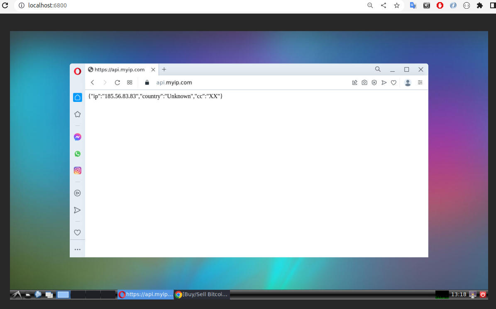

# about

This is an example of such solution - containers with tunnels to proxy servers and remote desktop

## server side containers

- desktop - VNC based desktop from project `dorowu/ubuntu-desktop-lxde-vnc`

- front_proxy - squid proxy with up-layer tor-proxy in the standalone container. The tor-proxy container is also available in the desktop container. Opera browser use that proxy with launching `opera-torproxy`.

- simple_proxy - just container for squid proxy server

## client side containers

Pay attention the build process of server containers will print 3 private keys to use it the client containers.

- desktop_tunnel - container provide a local port to use remote desktop

- torproxy_tunnel - container provide a local port to use http proxy with tor anonymizer

- proxy_tunnel - container provide a local port to use the http proxy server that is located on the host system network.

## ps

- Better to replace `proxyuser` to the random name.

- Do not forget configure security settings of Opera in the desktop container.
